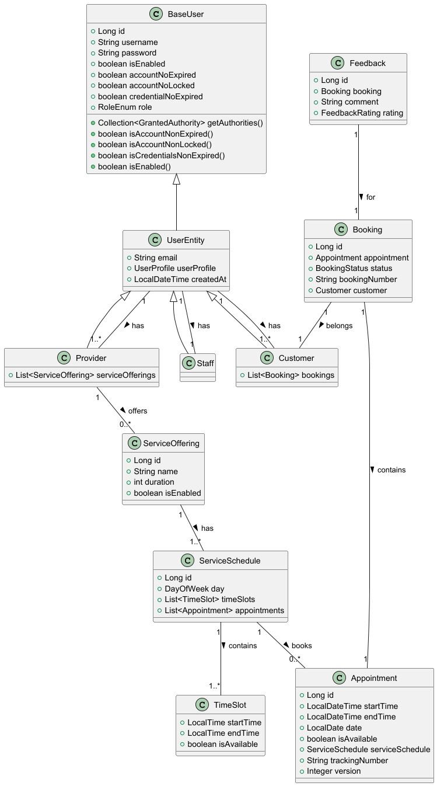

# EasyReserve

## Descripción del proyecto

EasyReserve es una aplicación diseñada para gestionar reservas de manera eficiente en establecimientos, desarrollada con Spring Boot. Su propósito es facilitar la creación, edición, y cancelación de reservas por parte de los usuarios y permitir a los administradores gestionar la disponibilidad. La aplicación utiliza una arquitectura de capas para mejorar la escalabilidad y el mantenimiento.

## DIAGRAMA DE CLASES



# Instrucciones para Levantar la Aplicación con Docker

## Requisitos Previos

Antes de comenzar, asegúrate de tener instalados los siguientes programas:

- [Docker](https://www.docker.com/products/docker-desktop) (para crear y gestionar los contenedores)
- [Docker Compose](https://docs.docker.com/compose/) (para gestionar múltiples contenedores)

## Paso 1: Clonar el Repositorio

Si aún no tienes el repositorio clonado, ejecuta:

``` bash
git clone https://github.com/alvarowau/tu-repositorio.git
cd tu-repositorio
```

## Paso 2: Configurar y Levantar los Contenedores
La aplicación está configurada para usar diferentes entornos: Desarrollo (dev), Producción (prod) y Pruebas (test). Para levantar la aplicación, puedes usar perfiles en Docker Compose que permiten iniciar solo el entorno que necesitas.

## Paso 3: Levantar los Servicios de un Entorno Específico
### 1. Entorno de Desarrollo (dev):
   Para levantar los servicios de desarrollo, incluyendo la base de datos y la aplicación, ejecuta el siguiente comando:

````bash
 docker-compose --profile dev up --build
````

Este comando descargará las imágenes necesarias, construirá la imagen de la aplicación y levantará los servicios para el entorno de desarrollo. Nota: La primera vez que levantes el entorno, puede tardar un poco más, ya que se inicializará y llenará la base de datos con los datos de prueba.

### 2. Entorno de Producción (prod):
   Para levantar los servicios de producción, ejecuta:

````bash
docker-compose --profile prod up --build
````

Esto levantará la aplicación y la base de datos configurada para producción. Nota: La primera vez también puede tardar más debido a la inicialización de la base de datos.

### 3. Entorno de Pruebas (test):
   Para levantar los servicios de pruebas, ejecuta:

````bash
docker-compose --profile test up --build
````

Este comando inicia el entorno para realizar pruebas, con su propia base de datos y configuración.

### Paso 4: Acceder a la Aplicación
Una vez que los contenedores estén levantados, podrás acceder a la aplicación en los siguientes puertos según el entorno que hayas elegido:

- Desarrollo (dev): [http://localhost:8080](http://localhost:8080)
- Producción (prod): [http://localhost:8081](http://localhost:8081)
- Pruebas (test): [http://localhost:8082](http://localhost:8082)


### Paso 5: Detener los Contenedores
Cuando hayas terminado de trabajar, puedes detener todos los contenedores con el siguiente comando:

````bash
docker-compose down
````


Este comando detiene y elimina los contenedores, redes y volúmenes asociados con la configuración actual.

### Notas Adicionales
La primera vez que levantes la aplicación, Docker descargará las imágenes necesarias y construirá la imagen de la aplicación, lo cual puede tardar algunos minutos. Además, las bases de datos se inicializarán con los datos correspondientes para cada entorno, lo que también puede llevar algo de tiempo.

Si necesitas ver los logs de la aplicación o de los contenedores de la base de datos, puedes usar el comando:

````bash
docker-compose logs
````

Para realizar cambios en la aplicación y reconstruir la imagen, puedes ejecutar:

````bash
docker-compose --profile dev up --build
````

Asegúrate de cambiar el perfil (dev, prod, test) según lo que necesites.

## Tecnologías utilizadas en el proyecto

1. **Spring Boot**  
   *Framework de desarrollo de aplicaciones Java que simplifica la creación de aplicaciones y microservicios. Utiliza configuraciones predeterminadas, permite el inicio rápido y facilita la integración con otros servicios.*

2. **Spring Security**  
   *Framework para la seguridad de aplicaciones, proporcionando autenticación y autorización. Facilita la protección de endpoints y la integración con sistemas de autenticación, como JWT, para el control de acceso.*

3. **Spring Data JPA**  
   *Simplifica la interacción con bases de datos utilizando Java Persistence API (JPA). Permite realizar operaciones CRUD y consultas complejas de forma sencilla y eficiente.*

4. **MySQL**  
   *Sistema de gestión de bases de datos relacional utilizado para almacenar datos de la aplicación, como información de usuarios, reservas, y servicios.*

5. **JWT (JSON Web Token)**  
   *Especificación para la transmisión segura de información entre partes como un objeto JSON. En este proyecto se utiliza para la autenticación y autorización basada en tokens.*

6. **Lombok**  
   *Biblioteca que reduce el boilerplate en Java, generando automáticamente métodos como `getters`, `setters`, `equals()`, `hashCode()`, y `toString()` con anotaciones simples.*

7. **ModelMapper**  
   *Biblioteca que facilita la conversión de objetos entre diferentes clases, ayudando a simplificar el mapeo de DTOs y entidades.*

8. **Swagger**  
   *Herramienta para generar documentación interactiva de APIs RESTful. Permite a los desarrolladores explorar y probar los endpoints de la API desde una interfaz web, facilitando la comprensión y uso de la API.*

9. **Docker**  
   *Herramienta que permite empaquetar la aplicación en contenedores, asegurando que pueda ejecutarse de manera consistente en diferentes entornos sin necesidad de configuraciones adicionales.*

10. **Docker Compose**  
    *Herramienta que permite definir y ejecutar aplicaciones multi-contenedor. Facilita la configuración y la ejecución de aplicaciones distribuidas con varios servicios, como bases de datos y la propia aplicación, a través de un único archivo `docker-compose.yml`.*

## Documentación de la API

Esta API está documentada utilizando **Swagger** para facilitar la visualización y prueba de los diferentes endpoints disponibles. Swagger proporciona una interfaz gráfica que permite interactuar con la API de manera intuitiva, sin necesidad de herramientas externas.

### **Acceder a Swagger UI**

Para acceder a la documentación interactiva de la API, simplemente abre tu navegador web y navega a la siguiente dirección:

````html
http://localhost:{PORT}/swagger-ui.html
````

Esto te llevará a la interfaz gráfica de Swagger, donde podrás explorar los diferentes controladores, ver los detalles de cada endpoint y probar las peticiones directamente desde la interfaz.

### **Funcionalidades principales de Swagger UI**:

- **Visualización de Endpoints**: Swagger genera una lista completa de todos los endpoints de la API, organizada por controlador y agrupada por las funcionalidades correspondientes (como gestión de reservas, citas, usuarios, etc.).

- **Descripción detallada de cada endpoint**: Para cada endpoint, podrás ver una descripción que incluye:
    - El método HTTP utilizado (GET, POST, PUT, PATCH, DELETE, etc.)
    - El formato de las solicitudes y las respuestas
    - Los parámetros requeridos y sus descripciones
    - Ejemplos de respuestas para facilitar la comprensión

- **Prueba de solicitudes**: Una de las características más útiles de Swagger UI es la posibilidad de realizar peticiones directamente desde la interfaz. Puedes seleccionar el endpoint que desees probar, ingresar los parámetros requeridos, y hacer clic en el botón para ejecutar la solicitud. Esto es útil para verificar cómo funciona la API sin tener que usar herramientas adicionales como Postman o cURL.

- **Manejo de respuestas**: Swagger también muestra ejemplos de las respuestas que devolvería la API, lo que te permite verificar los formatos de datos y los posibles códigos de estado HTTP para cada operación.

### **Ventajas de usar Swagger**:

- **Documentación en tiempo real**: La documentación siempre está actualizada con el código de la API, lo que facilita el mantenimiento y la comprensión de los endpoints.
- **Interactividad**: Los usuarios pueden probar los endpoints de forma directa y comprobar cómo se comportan con diferentes entradas, todo desde el navegador.
- **Accesibilidad**: No se requieren conocimientos técnicos avanzados para utilizar la interfaz de Swagger; solo necesitas acceso a la URL correspondiente y saber qué funcionalidad deseas consultar.

### **Configuración de Swagger**

La configuración de Swagger está integrada en el proyecto, lo que permite acceder automáticamente a la interfaz cuando el servidor de la API esté en funcionamiento. Si todo está correctamente configurado, la documentación será accesible desde cualquier navegador a la ruta mencionada anteriormente.

## Rutas de la API

### 1. **BookingController (Gestión de Reservas)**
#### Ruta base: /bookings
    - createBookingByTrackingNumber (CUSTOMER) -> POST /bookings/create/by-tracking-number
    - createBookingById (CUSTOMER) -> POST /bookings/create/by-id
    - cancelBookingByUser (CUSTOMER) -> PATCH /bookings/cancel/customer
    - cancelBookingByStaff (STAFF) -> PATCH /bookings/cancel/staff
    - getBookingsForStaff (STAFF) -> GET /bookings/bookings/staff
    - getBookingHistory (CUSTOMER) -> GET /bookings/history
    - getProviderBookingHistory (PROVIDER) -> GET /bookings/provider/reservations


### 2. **AppointmentController (Gestión de Citas)**
#### Ruta base: /appointments
    - getAvailableAppointmentsForProvider (STAFF, CUSTOMER, PROVIDER) -> GET /appointments/available/by-provider/{username}
    - getAvailableAppointmentsForServiceOffering (STAFF, CUSTOMER, PROVIDER) -> GET /appointments/available/by-service-offering/{serviceOfferingName}
    - getAvailableAppointmentsForServiceOfferingAndId (STAFF, CUSTOMER, PROVIDER) -> GET /appointments/available/by-service-offering/id/{serviceOfferingName}
    - getAvailableAppointmentsByDate (STAFF, CUSTOMER, PROVIDER) -> GET /appointments/available/by-date/{date}
    - getAvailableAppointmentsByDateRange (STAFF, CUSTOMER, PROVIDER) -> GET /appointments/available/by-date-range


### 3. **ActionLogManagementController**  
   #### Ruta base: /actions
    - Obtener logs por tipo de acción (STAFF) -> GET /actions/by-action-type/{actionType}
    - Listar todos los logs de acciones (STAFF) -> GET /actions


### 4. **FeedbackController**  
   #### Ruta base: /feedbacks
    - Crear un feedback para una reserva (CUSTOMER) -> POST /feedbacks
    - Obtener todos los feedbacks del usuario autenticado (CUSTOMER) -> GET /feedbacks/user
    - Obtener feedbacks por oferta de servicio (PROVIDER) -> GET /feedbacks/service-offerings/{serviceOfferingName}
    - Obtener todos los feedbacks de un proveedor (STAFF) -> GET /feedbacks/providers/{providerUsername}
    - Obtener el rating promedio de un proveedor (STAFF) -> GET /feedbacks/providers/{providerUsername}/average-rating


### 5. **ServiceOfferingController**  
   #### Ruta base: /services
    - Crear oferta de servicio (PROVIDER) -> POST /services
    - Obtener servicios por proveedor (STAFF, CUSTOMER, PROVIDER) -> GET /services/provider/{username}


### 6. **ServiceScheduleController**  
   #### Ruta base: /schedule
    - Crear horario de servicio (PROVIDER) -> POST /Schedule


### 7. **AuthenticationController**  
   #### Ruta base: /auth
    - POST /auth/login - Inicia sesión de usuario (requiere credenciales válidas)


### 8. **TestAuthController**  
   #### Ruta base: /test
    - GET /test/staff-data - Acceso solo para usuarios con rol STAFF
    - GET /test/provider-data - Acceso solo para usuarios con rol PROVIDER
    - GET /test/customer-data - Acceso solo para usuarios con rol CUSTOMER
    - GET /test/common-data - Acceso para usuarios con rol STAFF o CUSTOMER
    - GET /test/public-data - Acceso público para todos los usuarios


### 9. **UserController**  
   #### Ruta base: /user
    - POST /user/sign-up/{role} - Registro de un usuario con un rol específico


### 10. **UserManagementController**  
#### Ruta base: /user-management
    - DELETE /user-management/deactivate/current - Desactivar la cuenta del usuario actual (acceso para cualquier usuario con rol STAFF, CUSTOMER o PROVIDER)
    - DELETE /user-management/staff/deactivate-user - Desactivar la cuenta de otro usuario (solo personal con rol STAFF)
    - PUT /user-management/staff/activate-user - Activar la cuenta de otro usuario (solo personal con rol STAFF)


## Trabajo futuro

### Integración de pagos
Implementar una funcionalidad de pago en línea para las reservas realizadas a través de la plataforma, permitiendo a los usuarios realizar pagos con tarjeta de crédito o servicios de pago como PayPal.

### Notificaciones por correo electrónico/SMS
Implementar un sistema de notificaciones para informar a los usuarios sobre cambios en sus reservas, citas o estados de feedback a través de correo electrónico o mensajes de texto (SMS).

### Mejora de la seguridad
Mejorar la seguridad de la API mediante la implementación de autenticación de dos factores (2FA) para los usuarios y proveedores, así como aumentar las medidas de protección de datos sensibles.

### Optimización de la base de datos
Realizar una auditoría y optimización de las consultas de la base de datos para mejorar el rendimiento de la aplicación en entornos de alto tráfico.

### Soporte para múltiples idiomas
Implementar soporte multilingüe en la interfaz de usuario y en los mensajes de error de la API, permitiendo que la aplicación sea utilizada por una audiencia internacional.

## Recursos

### Tecnologías utilizadas:

- **Spring Boot**: Framework principal para el desarrollo de la API RESTful.
- **Swagger/OpenAPI**: Para la documentación automática de la API y pruebas interactivas.
- **Lombok**: Para reducir la cantidad de código repetitivo en las clases Java.
- **Spring Security**: Para la gestión de la autenticación y autorización de usuarios.
- **Docker/Podman**: Para la contenedorización y la creación de entornos de desarrollo reproducibles.
- **JUnit / Mockito**: Para pruebas unitarias y de integración.
- **Git**: Control de versiones utilizado para la gestión del código fuente.
- **Maven**: Herramienta de construcción utilizada en el proyecto.

### Herramientas de desarrollo:

- **IntelliJ IDEA**: Entorno de desarrollo integrado (IDE) utilizado en el proyecto.
- **Postman**: Herramienta utilizada para probar los endpoints de la API.
- **GitHub**: Repositorio remoto utilizado para el almacenamiento y la gestión del código.
- **Trello**: Herramienta para la gestión de proyectos y tareas.
- **Slack**: Comunicación interna entre los miembros del equipo.

### Recursos de infraestructura:

- **Entorno de desarrollo local**: Configuración para ejecutar el proyecto en el equipo local de los desarrolladores. Se utiliza Docker para crear contenedores que simulan el entorno de producción, asegurando que los desarrolladores puedan ejecutar el proyecto de manera consistente en sus máquinas locales.

### Guía de Contribución:

- **Fork del repositorio**: Crea un fork del repositorio en GitHub para realizar modificaciones y mejoras en el código.
- **Ramas de trabajo**: Utiliza ramas descriptivas para el desarrollo de nuevas funcionalidades o la corrección de errores. Ejemplo: `feature/nueva-funcionalidad` o `bugfix/correccion-error`.
- **Convenciones de codificación**: Asegúrate de seguir las convenciones de codificación acordadas en el proyecto (por ejemplo, reglas de nomenclatura de clases, métodos y variables).
- **Pruebas**: Agrega pruebas unitarias o de integración para cualquier nueva funcionalidad desarrollada o cambio realizado. Usa JUnit y Mockito para las pruebas.
- **Pull requests**: Cuando termines tu trabajo, realiza un pull request con una descripción clara de los cambios realizados. Asegúrate de que el código sea revisado por otro miembro del equipo antes de ser fusionado.
- **Documentación**: Si se realizan cambios significativos en la API o en la arquitectura, asegúrate de actualizar la documentación generada por Swagger.

### Enlaces adicionales 

- **Presentación**: [Enlace a la presentación](https://docs.google.com/presentation/d/1BkW_Ud2q8X5RkIxsjOGtxF_ueI3uJCkp9Dg4ro8GFHo/edit?usp=sharing)
- **Trello**: [Proyecto EasyReserve](https://trello.com/invite/b/6717fac496ab7c9e3d3d56a7/ATTI3b87ef0bf0690f22f472fd70d35553ccB1992755/proyecto-easyreserve)

## Licencia

Este proyecto está licenciado bajo la **MIT License**. Para más detalles, consulta el archivo de
licencia [LICENSE](LICENSE) o visita [Creative Commons MIT License](https://opensource.org/licenses/MIT).